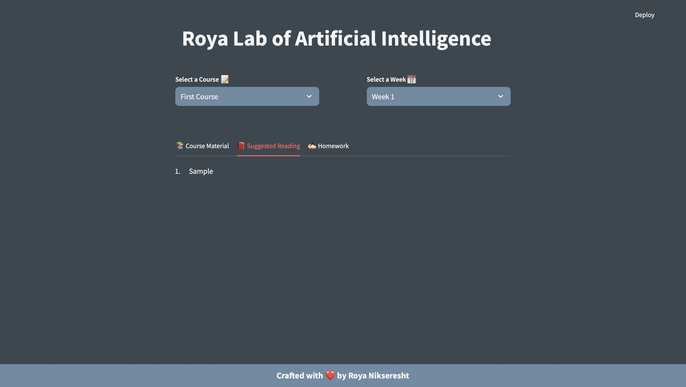

# Roya Lab of Artificial Intelligence

A super useful **Streamlit** application that enables me to efficiently share homework assignments, slides, and suggested reading for each week of the courses I teach as a guest lecturer or freelance trainer.

## 🚀 Demo

**v.0.0.1**

<p align="center">
    
</p>

<p align="center">
    
</p>

## ⚒️ Usage

To get started with this app, follow the steps below:

1. **Clone the repository**:
    ```bash
    git clone https://github.com/royanikseresht
    ```

2. **Change the directory** to the cloned project:
    ```bash
    cd RoyaLab
    ```

3. **Ensure you have Python** installed. You can download it [here](https://www.python.org/downloads/).

4. **Create a new virtual environment**:
    ```bash
    python -m venv env
    ```

5. **Activate the virtual environment**:
    - On **Mac/Linux**:
        ```bash
        source env/bin/activate
        ```
    - On **Windows**:
        ```bash
        env/Scripts/Activate.ps1 
        ```

6. **Install the dependencies**:
    ```bash
    pip install -r requirements.txt
    ```

7. **Start the application**:
    ```bash
    streamlit run app.py
    ```

## Data Schema

The data is currently stored in a **JSON** file with the following schema:

```json
[
    {
        "course_code": "DLH301",
        "course_name": "First Course",
        "pre-requisites": "...",
        "description": "...",
        "instructors": ["Roya Nikseresht"],
        "semester": "Fall 2024",
        "material": [
            {
                "week_number": 1,
                "topic": "Introduction to Deep Learning and Healthcare",
                "g_slide": "https://docs.google.com/presentation/d/19dP-SEXY0BUVGL16pJml3nT94HOXIXh2FxtHD2z7cws/edit?usp=sharing",
                "reading": [
                    "Deep Learning by Ian Goodfellow, Yoshua Bengio, and Aaron Courville",
                    "Deep Medicine: How Artificial Intelligence Can Make Healthcare Human Again by Eric Topol"
                ]
            },
            {
                ...
            }
        ]
    },
    {
        "course_code": "......",
        "course_name": "......",
        ...
    }
]

```

## Potential Features

- Display as PDF
- Load JSON into pandas, parse it, Display in an editable dataframe using AGGrid
- CRUD on JSON using pandas + AGGRID
- Use a wide column or KV Database
- Semantic Search
- GPT-4
- Improve UI
- t3 trial
- CMS
- Dockerize

## 🛡️ License

This project is licensed under the GNU Affero General Public License v3.0 License - see the [`LICENSE`](LICENSE) file for details.

